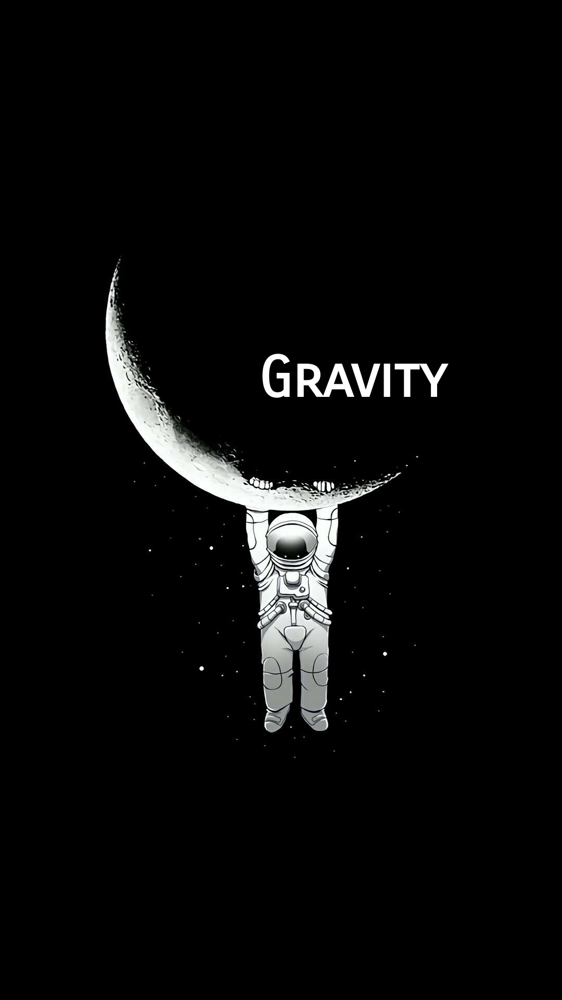
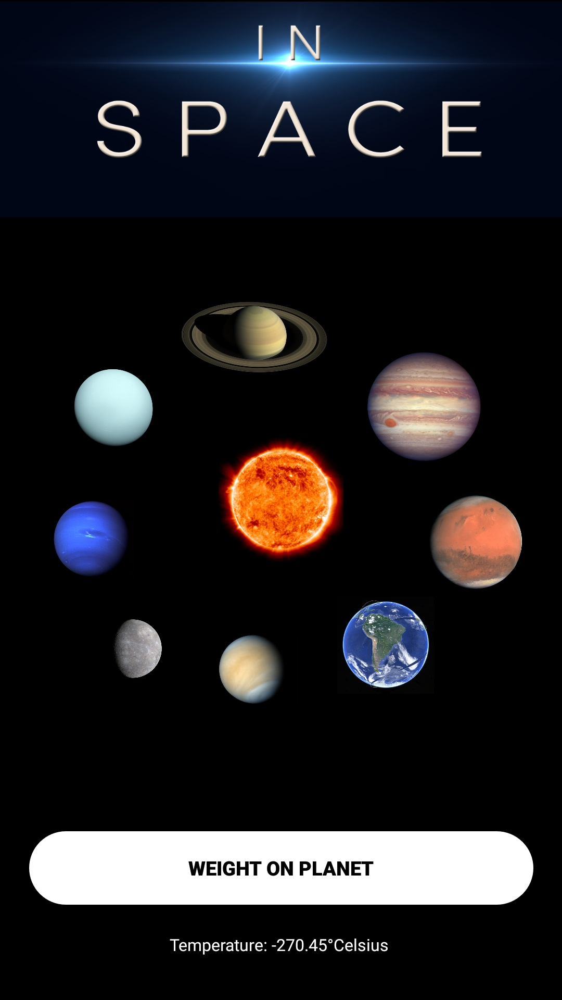
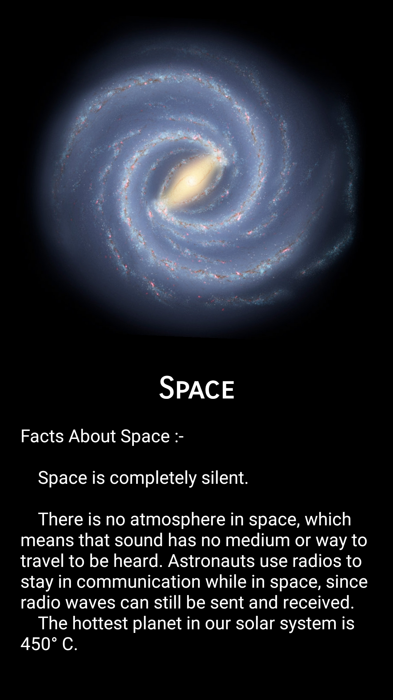
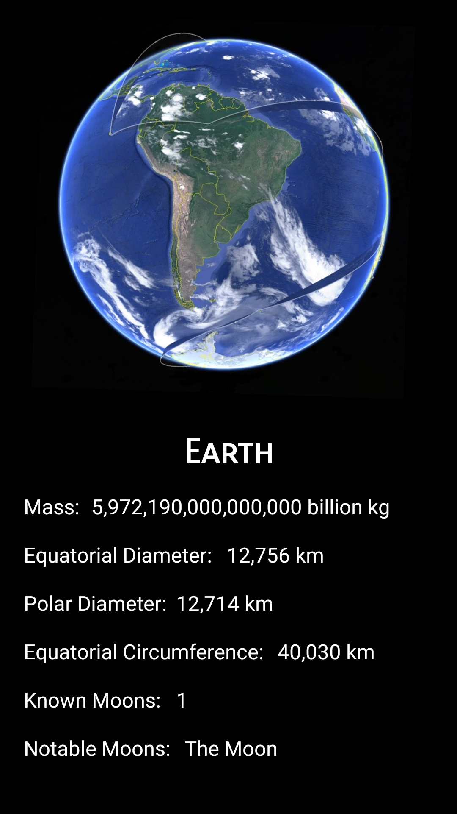
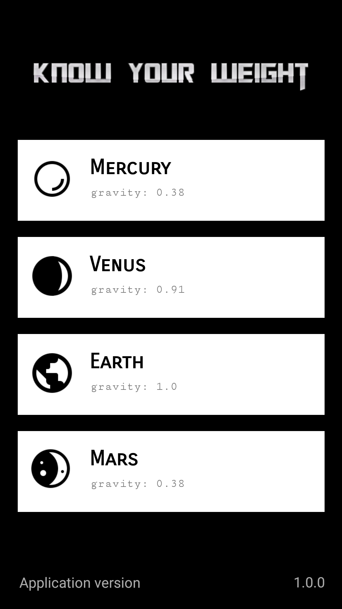
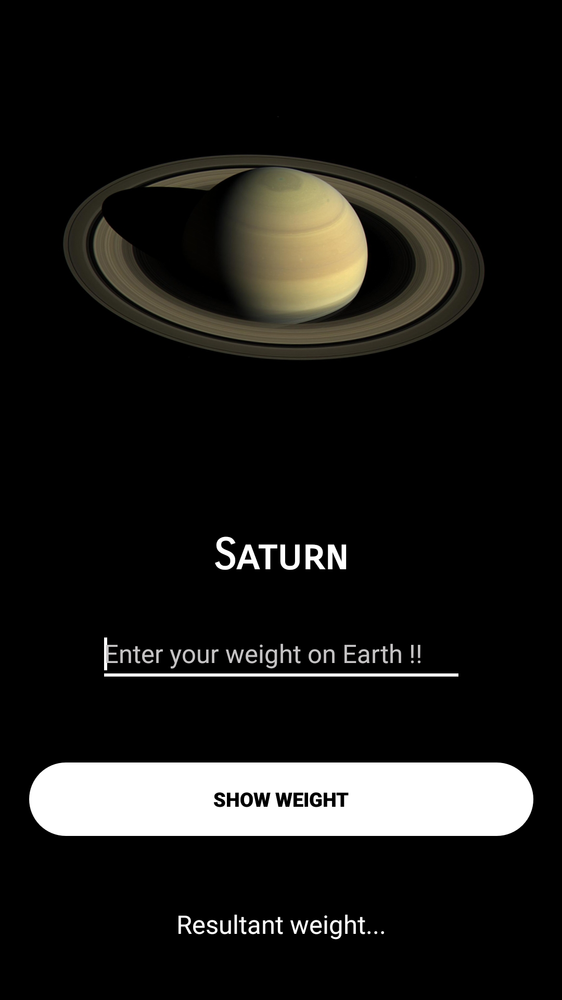

#  Gravity app

[](https://github.com/ashish7zeph/android-kotlin-Gravity-app/blob/master/LICENSE)
[](https://github.com/ashish7zeph/android-kotlin-Gravity-app/graphs/contributors)
[](https://kotlinlang.org/)

[](https://www.android.com/)

## Overview

Build a Space Information android app with kotlin support

It is an Information app providing the info of each and every planet in the solar system also it contain an classed activity for calculation of user weight on different planets in the solar system

Its an Info App!!

## Features

* Splash screen
* Animation styles
* Customised buttons
* Custom ListView
* Switiching animations
* Minimal Design
* Simplified Theme
* Responsive BackPress

## Platform
        -> Android Studio
        -> With Kotlin Support

## Instructions

1. Clone or download the repo: `https://github.com/ashish7zeph/android-kotlin-Gravity-app`
2. Navigate to the folder `android-kotlin-Gravity-app`
3. Navigate to the folder `android-kotlin-Gravity-app/app/src/` to access developers content
3. Navigate to the folder `apk` for users to access apk
4. Copy the apk from folder `apk` to an android phone
5. Install the apk

The app is finally installed on your Android mobile device !!
To directly download the apk visit the [link](https://github.com/ashish7zeph/android-kotlin-Gravity-app/tree/master/apk)

 # Screenshots:

<div style="display:flex;">



</div>


<div style="display:flex;">



</div>

## Kotlin Android Activity

Kotlin code of the splash screen activity in this project is shown below. For kotlin code of other activities visit the [link]()
```kotlin
package com.zeph7.gravity

import android.content.Intent
import android.support.v7.app.AppCompatActivity
import android.os.Bundle
import android.os.Handler
import android.view.Window
import android.view.WindowManager
import android.view.animation.AnimationUtils
import kotlinx.android.synthetic.main.activity_splash.*

class SplashActivity : AppCompatActivity() {

    override fun onCreate(savedInstanceState: Bundle?) {
        super.onCreate(savedInstanceState)

        window.requestFeature(Window.FEATURE_NO_TITLE)

        window.setFlags(WindowManager.LayoutParams.FLAG_FULLSCREEN,
            WindowManager.LayoutParams.FLAG_FULLSCREEN
        )

        setContentView(R.layout.activity_splash)

        Handler().postDelayed({
            startActivity(Intent(this@SplashActivity, MainActivity::class.java))
        }, 1000)
    }
}
```

Planets class is used throught the Project Activities to get the Activity for each planet

```kotlin
package com.zeph7.gravity

import java.io.Serializable

class Planet (val Name: String, val Image: Int, val Gravity: Double): Serializable{
}
```
